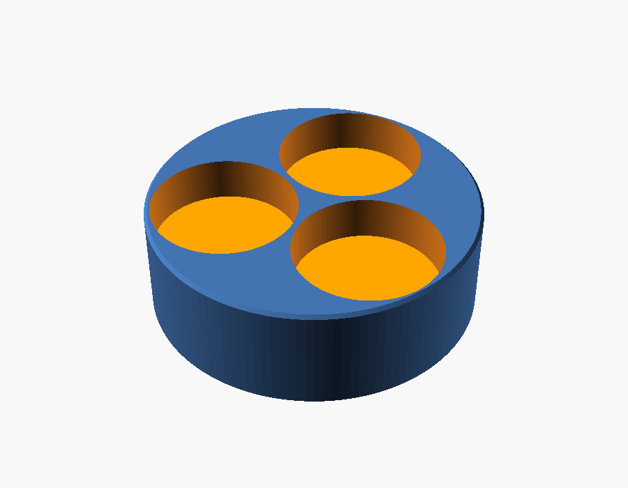

# Porta-amostras de 30 mm para pastilhas prensadas de 13 mm (LA-ICP-MS / LIBS)

É um disco com a seção de 30 mm que o porta-amostras do equipamento já aceita, com cavidades onde as
pastilhas de 13 mm entram **sem resina e sem polimento**. A pastilha sai intacta e pode ser reanalisada
ou guardada.



## Como funciona

- Cada cavidade tem um **pistão** solto (disco de 12,9 mm) no fundo, e a pastilha apoia sobre ele.
- Um **parafuso M3** entra por baixo e empurra o pistão. Assim cada pastilha fica com a face de análise
  **no mesmo plano do topo do suporte**, qualquer que seja a espessura dela. Isso mantém o foco do laser
  (LA) e a distância lente–amostra (LIBS) iguais em todas as amostras.
- O mesmo parafuso serve de extrator: basta apertar para a pastilha subir e sair.
- As cavidades vêm numeradas no fundo (1, 2, 3).

## Nivelamento sem instrumento (face no plano por construção)

1. Apoie uma lâmina de vidro limpa (ou uma placa plana) na bancada.
2. Coloque as pastilhas sobre o vidro **com a face de análise para baixo**.
3. Encaixe o suporte por cima, de cabeça para baixo, de modo que cada pastilha entre na sua cavidade.
   O topo do suporte e as faces das pastilhas ficam todos apoiados no vidro.
4. Coloque os pistões e aperte os parafusos só até encostar.
5. Vire o conjunto. As faces ficam rentes ao topo, sem tocar em nada que contamine.

## Arquivos

| Arquivo | Conteúdo |
|---|---|
| `porta_amostras_30mm.scad` | Modelo paramétrico (OpenSCAD). Abra em *Window → Customizer* para mudar as medidas. |
| `stl/suporte_1x13mm.stl` | Suporte para 1 pastilha |
| `stl/suporte_2x13mm.stl` | Suporte para 2 pastilhas (parede externa 1,55 mm) |
| `stl/suporte_3x13mm.stl` | Suporte para 3 pastilhas (parede externa ≈ 0,5 mm, parede entre cavidades 0,6 mm) |
| `stl/pistao_13mm.stl` | Pistão (é preciso um por cavidade) |

Medidas padrão: Ø 29,9 mm (30 mm − 0,1 mm de folga), altura 10 mm, cavidades de Ø 13,1 mm com 7 mm de
profundidade e fundo de 3 mm.

**Antes de fabricar, confira** a altura máxima que o porta-amostras do equipamento aceita e a faixa de
espessura das pastilhas. A cavidade (7 mm) menos o pistão (2 mm) admite pastilhas de até 5 mm.

## Fabricação

- **Versão para 3 pastilhas:** as paredes ficam finas (≈ 0,5 mm na borda), porque três círculos de 13 mm
  ocupam quase todo o círculo de 30 mm. Funciona bem **usinada** em alumínio, PEEK ou POM (Delrin).
  Em impressão 3D, use resina SLA, não FDM.
- **Versão para 2 pastilhas:** é mais robusta e pode ser impressa em FDM (PETG/PLA) para teste.
- **Folgas:** `folga_pastilha` = 0,05–0,15 mm para usinagem e 0,15–0,25 mm para impressão.
  Faça um teste de encaixe com uma pastilha real antes de produzir várias peças.
- **Rosca:** o furo de 2,5 mm é para abrir rosca M3 com macho. Para FDM, use `furo_parafuso = 3.2` com
  inserto metálico ou porca. Use parafuso M3 de cabeça chata ou sem cabeça (grub screw) para o fundo
  ficar plano.

## Contaminação

Só a pastilha é ablada. O suporte e o pistão não entram no plasma, desde que o laser não seja
posicionado na borda. Recomenda-se:

- limpar o suporte em ultrassom (água ultrapura / etanol) entre usos;
- fazer pré-ablação (pulsos de limpeza) antes da aquisição, para remover a camada superficial manuseada;
- se necessário, apoiar a pastilha sobre fita de carbono dupla face no pistão, para que ela não se mova.

## Regenerar os STL

```sh
openscad -o stl/suporte_3x13mm.stl -D 'peca="suporte"' -D n_pastilhas=3 porta_amostras_30mm.scad
openscad -o stl/pistao_13mm.stl    -D 'peca="pistao"' porta_amostras_30mm.scad
```
