# Porta-amostras de 30 mm para pastilhas prensadas de 13 mm (LA-ICP-MS / LIBS)

É um cilindro com a seção de 30 mm que o porta-amostras do equipamento já aceita, com cavidades para
pastilhas de 13 mm. Segue a mesma ideia dos porta-amostras de seções polidas de MEV: a pastilha fica
**presa mecanicamente**, mesmo com o porta-amostras inclinado, e a **altura de cada pastilha é
ajustável**, de modo que todas as faces de análise ficam no mesmo plano. Não usa resina e não precisa
de polimento.

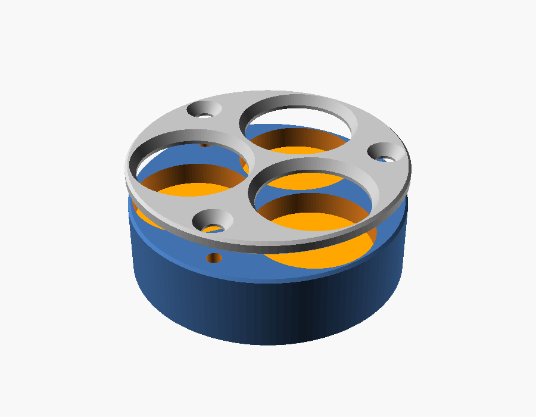

## Ajuste de altura (todas as versões)

Cada cavidade tem um **pistão** (disco solto de 12,9 mm) sob a pastilha. Um **parafuso M3 sem cabeça**,
que entra por baixo, empurra o pistão para cima. Cada pastilha é regulada de forma independente, o que
compensa a diferença de espessura entre elas. O mesmo parafuso serve para extrair a pastilha.

## Fixação: duas opções

### A) Tampa de fixação (`fixacao = "tampa"`): recomendada; serve para 1, 2 ou 3 pastilhas

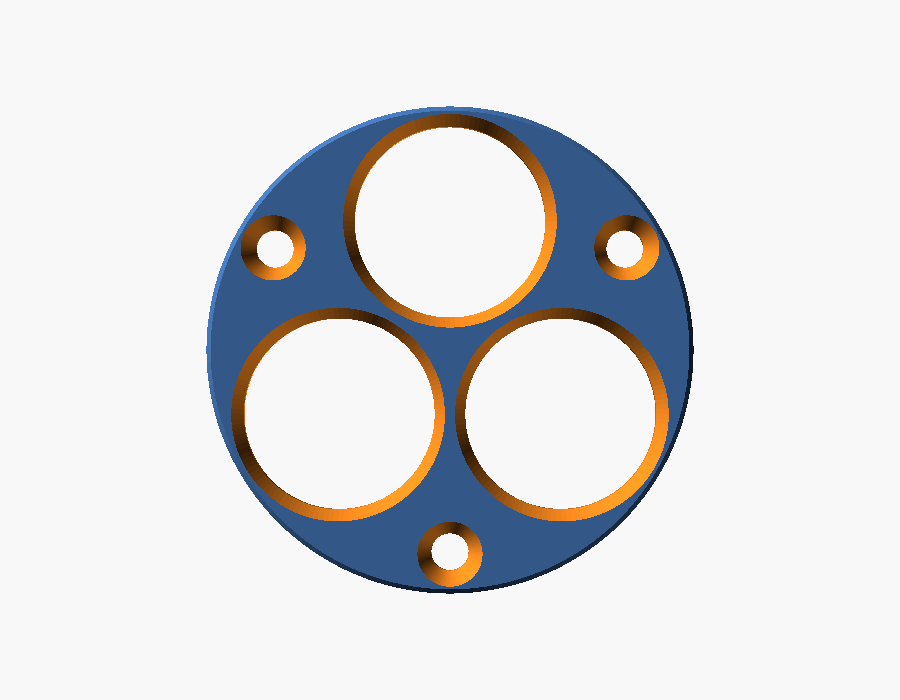

- A tampa é presa com parafusos M2 de cabeça chata escareada. Ela tem janelas de 11,8 mm, e a borda de
  cada janela cobre **0,6 mm** da borda da pastilha.
- Ao apertar o parafuso de baixo, a pastilha sobe até encostar na borda da janela. Isso **prende e
  nivela ao mesmo tempo**: todas as faces ficam encostadas no mesmo plano (a face inferior da tampa),
  seja qual for a espessura de cada pastilha.
- A face de análise fica 1,5 mm abaixo do topo. A janela tem chanfro, o que deixa espaço para o feixe e
  para o plasma com o porta-amostras inclinado.
- Área útil: círculo de ~11,8 mm em cada pastilha.

**Montagem:**
1. Coloque o pistão e a pastilha (face para cima) em cada cavidade.
2. Parafuse a tampa.
3. Por baixo, aperte cada parafuso M3 até a pastilha encostar na tampa. Encostou e travou, pare: o
   aperto deve ser leve, para não trincar a pastilha. Se quiser amortecer, coloque um disco fino de
   silicone ou de papel entre o pistão e a pastilha.

### B) Parafuso lateral com calço (`fixacao = "lateral"`): só para 1 ou 2 pastilhas

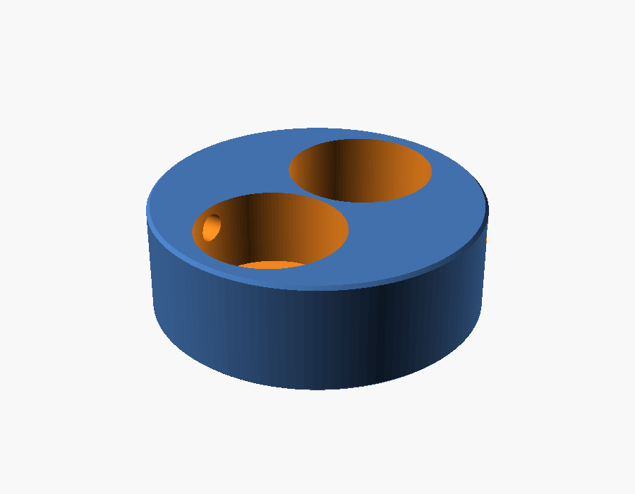

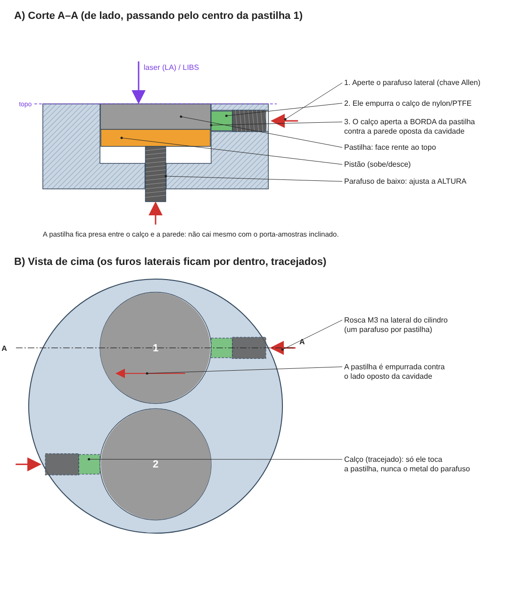

- Um parafuso M3 sem cabeça entra pela lateral do cilindro, como nos porta-amostras de MEV, e empurra um
  **calço de nylon ou PTFE** (Ø 2,3 × 2,5 mm) contra a borda da pastilha.
- A face fica **rente ao topo**, e nenhuma parte da pastilha fica coberta.
- O furo lateral está a 2 mm abaixo do topo, então a pastilha precisa ter **pelo menos ~2 mm de
  espessura** para o calço alcançá-la. Para pastilhas mais finas, use a versão com tampa.
- **Com 3 pastilhas não é possível:** três círculos de 13 mm ocupam quase todo o círculo de 30 mm e a
  parede da borda fica com ~0,5 mm, sem espaço para rosca.

**Montagem e nivelamento:**
1. Apoie uma lâmina de vidro limpa na bancada e coloque as pastilhas sobre ela com a face de análise
   para baixo.
2. Encaixe a base por cima, de cabeça para baixo.
3. Coloque os pistões e aperte os parafusos de baixo só até encostar.
4. Aperte os parafusos laterais.
5. Vire o conjunto. As faces ficam rentes ao topo e no mesmo plano.

## Arquivos

| Arquivo | Peça |
|---|---|
| `porta_amostras_30mm.scad` | Modelo paramétrico (OpenSCAD). Abra em *Window → Customizer* para mudar as medidas. |
| `stl/base_3x13mm_tampa.stl` + `stl/tampa_3x13mm.stl` | 3 pastilhas, fixação por tampa (3 parafusos M2) |
| `stl/base_2x13mm_tampa.stl` + `stl/tampa_2x13mm.stl` | 2 pastilhas, fixação por tampa (2 parafusos M2) |
| `stl/base_2x13mm_lateral.stl` | 2 pastilhas, parafuso lateral |
| `stl/base_1x13mm_lateral.stl` | 1 pastilha, parafuso lateral |
| `stl/pistao_13mm.stl` | Pistão (um por cavidade) |
| `stl/calco_lateral.stl` | Calço do parafuso lateral; de preferência, corte de um tarugo de nylon ou PTFE |

### Parafusos (por suporte)

| Versão | Fundo (altura) | Fixação |
|---|---|---|
| Tampa, 3 pastilhas | 3 × M3 sem cabeça (DIN 913), 8–10 mm | 3 × M2 × 8 cabeça chata (DIN 965) |
| Tampa, 2 pastilhas | 2 × M3 sem cabeça, 8–10 mm | 2 × M2 × 8 cabeça chata |
| Lateral, 2 pastilhas | 2 × M3 sem cabeça, 8–10 mm | 2 × M3 sem cabeça, 6 mm, + 2 calços |

### Medidas padrão

- Ø externo 29,9 mm e altura total de 10 mm (com tampa: base de 8,5 mm + tampa de 1,5 mm).
- Cavidades de Ø 13,1 mm.
- Espessura máxima de pastilha: 3,5 mm na versão com tampa e 5 mm na versão lateral.

**Antes de fabricar, confira** a altura máxima que o porta-amostras do equipamento aceita e altere
`altura`, se precisar.

## Versão para impressão FDM (Bambu Lab X1 Carbon)

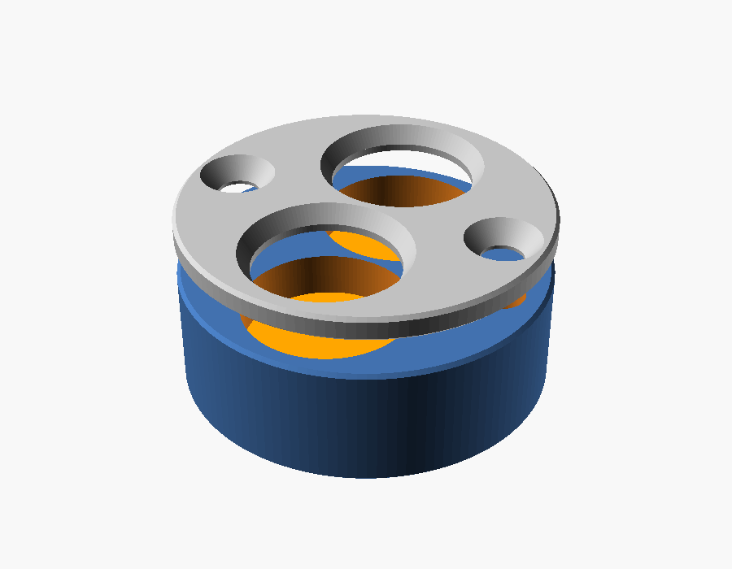

O arquivo `x1c_fdm.scad` usa o modelo principal com medidas próprias para FDM. Os STL prontos estão em
`stl/x1c/`.

**Diferenças em relação à versão usinada:**
- Configurada para **policarbonato (PC)**. Em `x1c_fdm.scad`, `material = "PETG"` troca as folgas para
  PETG.
- Folgas que compensam a contração do PC (~0,5–0,7 %): cavidade com +0,4 mm, seção com −0,1 mm e furo
  de inserto de 4,1 mm.
- Chanfro de 0,6 mm na borda de baixo, para absorver o "pé de elefante" da primeira camada.
- Todas as roscas são M3 em **insertos de latão**.
- Tampa de 2 mm presa com M3 escareado.
- Altura total de **12 mm**. Confira se o porta-amostras aceita essa altura; se não aceitar, altere
  `altura` em `x1c_fdm.scad`.
- Só 1 ou 2 pastilhas. A versão para 3 não é imprimível em FDM.

| Arquivo (`stl/x1c/`) | Peça |
|---|---|
| `teste_encaixe.stl` | Anel de 3 mm para testar a pastilha e o porta-amostras. **Imprima este primeiro.** |
| `base_2x13mm_tampa.stl` + `tampa_2x13mm.stl` | 2 pastilhas, com tampa (pastilhas de até 4,4 mm) |
| `base_1x13mm_tampa.stl` + `tampa_1x13mm.stl` | 1 pastilha, com tampa |
| `base_2x13mm_lateral.stl` / `base_1x13mm_lateral.stl` | Parafuso lateral (pastilhas de 2 a 6,4 mm) |
| `pistao_13mm.stl` | Pistão (um por cavidade) |

### Material

| Peça | Filamento | Por quê |
|---|---|---|
| Base, pistões e tampa | **PC transparente / natural** (sem pigmento) | É rígido, aguenta calor, cede pouco sob o aperto da tampa e não tem pigmento metálico. |

**PLA-CF não é recomendado para a tampa:**
- O PLA amolece a ~55–60 °C e **deforma com o tempo sob carga constante**: a pastilha afrouxa.
- A fibra deixa o PLA mais rígido, mas também **mais quebradiço**, e a borda da janela é fina.
- É sempre preto (fibra de carbono e negro de fumo). Se o laser pegar a borda, aparecem C e CN no LIBS.

Se quiser mesmo um filamento com fibra, use **PETG-CF** ou **PA-CF**, que deformam bem menos. O PA
precisa estar muito seco: absorve umidade, que depois sai na purga de He/Ar.

### Configuração de impressão em PC (Bambu Studio)
- **Secar o filamento:** o PC absorve umidade, e filamento úmido sai com bolhas e fios. Seque a 70–80 °C
  por 6–8 h em secadora e imprima direto da caixa seca (AMS com dessecante).
- **Perfil:** "Bambu PC" ou "Generic PC". Bico a 260–280 °C, mesa a 100–110 °C, ventilador entre 10 e
  30 %.
- **Câmara:** porta e tampa da X1C **fechadas**. Pré-aqueça a mesa por ~10 min antes de começar, para a
  câmara esquentar; isso reduz empenamento e trincas entre camadas.
- **Placa:** Engineering Plate ou Textured PEI, **com cola bastão** (o PC gruda forte demais no PEI liso
  e pode arrancar a superfície).
- **Camadas e preenchimento:** camadas de 0,12–0,16 mm, **preenchimento de 100 %** e 4 ou mais paredes.
- **Orientação:** base com o fundo na mesa e **ironing** no topo. Tampa com a **face inferior na mesa**,
  porque é a face que encosta nas pastilhas.
- **Brim:** de 3–5 mm na tampa, que é fina e plana. Na base, use se a borda levantar.
- **Retirada:** espere a placa esfriar antes de tirar as peças, para a tampa não entortar.
- **Contração:** **não** ligue a compensação de contração do fatiador; ela já está nas folgas do modelo.
- **Ordem:** imprima primeiro `teste_encaixe.stl`. Se a pastilha ficar justa demais, aumente
  `folga_pastilha` em 0,05–0,1; se a peça ficar folgada no porta-amostras, diminua `folga_secao`.

### Lista de compras (por suporte de 2 pastilhas, com tampa)

| Qtde | Item |
|---|---|
| 4 | Inserto de latão M3 para fixar a quente (M3 × 4 mm × Ø 4,5–5 mm; furo de 4,1 mm no modelo em PC) |
| 2 | Parafuso sem cabeça M3 × 10 mm, inox (DIN 913): ajuste de altura |
| 2 | Parafuso M3 × 10 mm escareado, inox (DIN 965 / ISO 10642): tampa |
| 1 | Chave Allen de 1,5 mm (+ chave Allen de 2 mm ou Phillips para a tampa, conforme o parafuso) |

Para a versão lateral, troque os 2 parafusos da tampa por **2 parafusos sem cabeça M3 × 6 mm com ponta
de nylon** e abra a rosca do furo lateral com **macho M3**. Para os insertos, use um ferro de solda
(~220 °C para PETG, ~260–280 °C para PC).

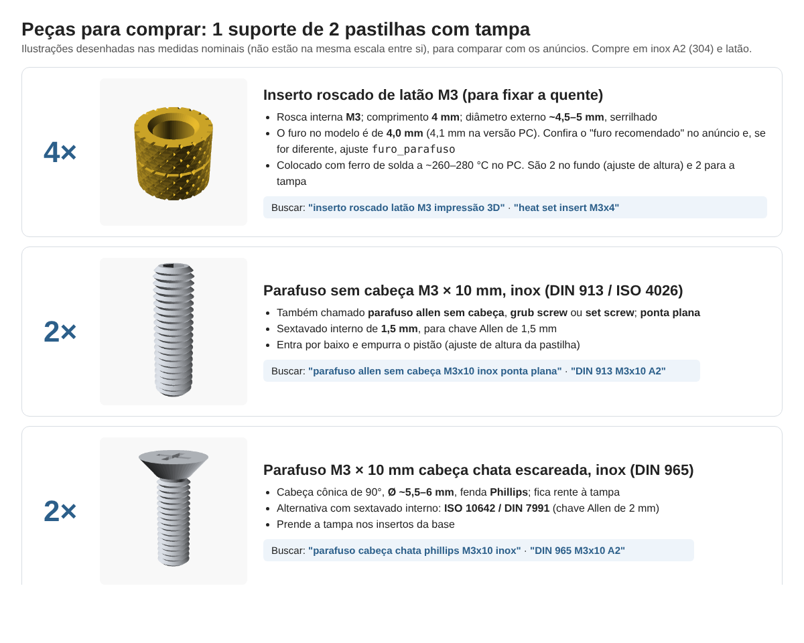

## Segundo modelo: ajuste de altura por mola (2 pastilhas, X1C em PC)

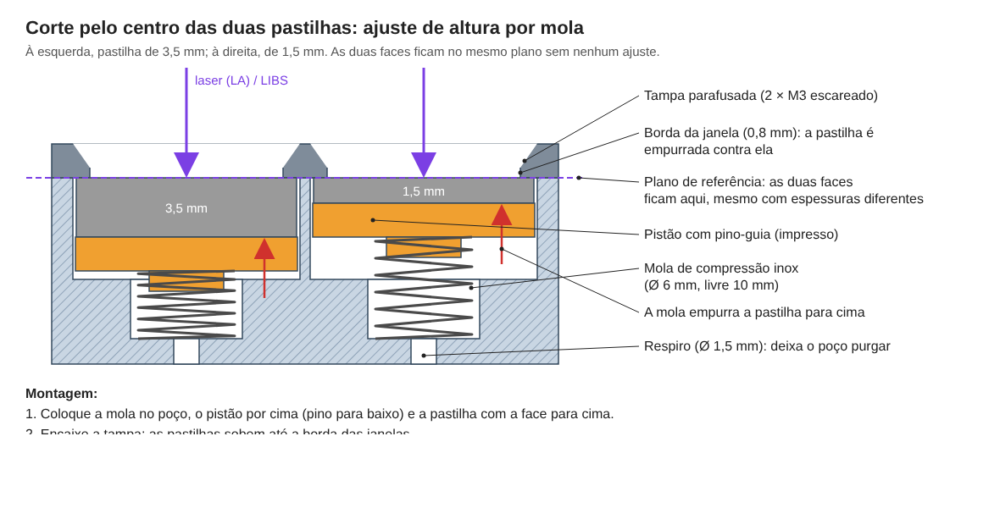

Em `x1c_mola_2x13mm.scad`, a mola substitui o parafuso de ajuste. Cada pastilha apoia num pistão
empurrado por uma **mola de compressão**. Ao parafusar a tampa, as molas comprimem e mantêm cada pastilha
pressionada contra a borda da janela.

**Como funciona:**
- **Sem ajuste manual:** as duas faces ficam sempre no mesmo plano (a face inferior da tampa), para
  qualquer espessura entre **1 e 4 mm**, mesmo que cada pastilha tenha uma espessura diferente.
- **Pressão constante:** a força da mola não depende de quanto você aperta, então o risco de trincar a
  pastilha é menor.
- **Troca rápida:** ao soltar a tampa, a mola levanta a pastilha.
- **Respiro de Ø 1,5 mm** no fundo de cada poço, para o gás da célula de LA purgar o ar preso.
- **Altura total de 13 mm**, sendo a base de 11 mm e a tampa de 2 mm. Confira se o porta-amostras aceita
  essa altura.

| Arquivo (`stl/x1c_mola/`) | Peça |
|---|---|
| `base_2x13mm_mola.stl` | Base com 2 cavidades e 2 poços de mola |
| `tampa_2x13mm.stl` | Tampa (igual à da versão com parafuso) |
| `pistao_mola_13mm.stl` | Pistão com pino-guia (imprima 2, com a face plana na mesa) |

A configuração de impressão em PC é a mesma da seção anterior.

### Lista de compras (modelo com mola)

| Qtde | Item |
|---|---|
| 2 | **Mola de compressão inox**: Ø externo **6 mm**, comprimento livre **10 mm**, fio de **0,4–0,5 mm** (comprimento sólido ≤ 3 mm) |
| 2 | Inserto de latão M3 para fixar a quente (só para a tampa) |
| 2 | Parafuso M3 × 10 mm escareado, inox (DIN 965) |

Não precisa de parafuso sem cabeça. Buscar por *"mola de compressão inox 0,5 × 6 × 10 mm"* (fio × Ø
externo × comprimento) ou *"compression spring 0.5x6x10 stainless"*. Kits sortidos de molas pequenas
costumam ter essa medida. Com fio de 0,4 mm a força fica em ~1–2 N por pastilha; com fio de 0,5 mm, em
~3–5 N. As duas servem; prefira **0,4 mm** se as pastilhas forem frágeis (sem aglutinante).

## Quarto modelo (recomendado): carregado por baixo, mola leve e fundo de baioneta

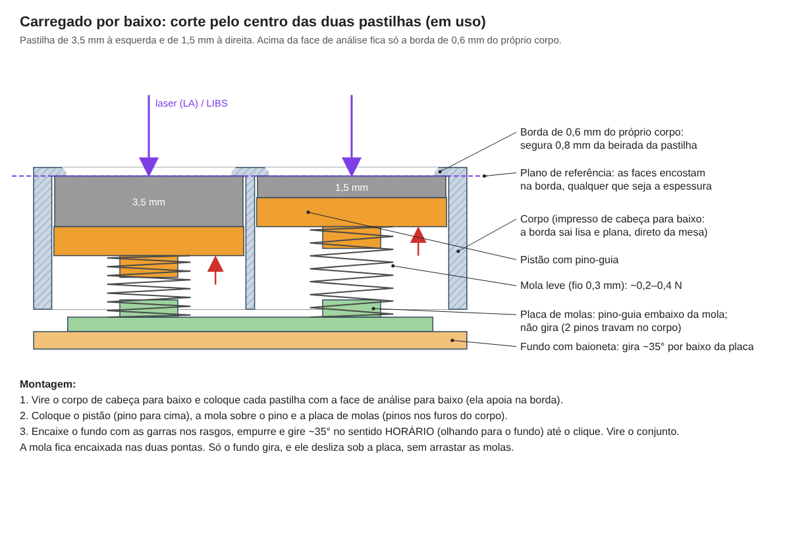

Em `x1c_mola_carga_inferior_2x13mm.scad`, **não há tampa nem anel por cima**. A própria peça tem, no topo
de cada furo, uma **borda de 0,6 mm** que segura 0,8 mm da beirada da pastilha. A pastilha entra **por
baixo**, com a face de análise para baixo; a mola a empurra contra essa borda; e um **fundo de baioneta**
fecha tudo.

**Por que este modelo substitui tampa + anel finos:** uma tampa e um anel com menos de 1 mm de plástico,
presos só pelas 2 garras (no eixo x), flexionariam vários décimos de milímetro sob a mola, na região das
pastilhas (no eixo y). As faces sairiam inclinadas e fora do mesmo plano. Aqui:
- Acima da face de análise fica **só a borda de 0,6 mm**. Não há aro, tampa nem parafuso no topo.
- A borda é parte do corpo e está presa em toda a volta da janela, então praticamente não flexiona.
- O corpo é impresso **de cabeça para baixo**, então as duas bordas saem direto da mesa: planas e no
  mesmo plano.
- **Nada gira sobre a face da pastilha.** Só o fundo gira, e ele desliza por baixo da placa de molas.
- **A mola fica encaixada nas duas pontas:** em cima, no pino do pistão; embaixo, no pino da **placa de
  molas**. A placa não gira (2 pinos entram em furos no corpo), então o giro do fundo não arrasta as
  molas.
- Altura total de **12 mm** (12,55 mm com o fundo travado): corpo de 9,8 mm + placa de 1,0 mm + fundo de
  1,2 mm.

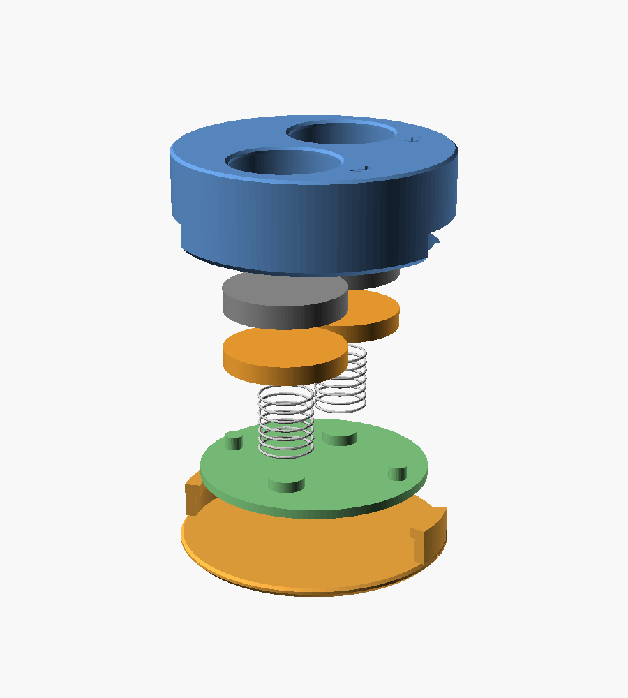

**Montagem:**
1. Vire o corpo de cabeça para baixo e coloque cada pastilha **com a face de análise para baixo**. Ela
   apoia na borda.
2. Coloque o pistão (pino para cima) e a mola sobre o pino.
3. Coloque a placa de molas com os pinos para baixo: os 2 pinos-guia entram nas molas e os 2 pinos de
   trava entram nos furos do corpo.
4. Encaixe o fundo com as garras nos rasgos, **empurre e gire ~35° no sentido horário** (olhando para o
   fundo, com o corpo de cabeça para baixo) até o clique.
5. Vire o conjunto. Para abrir, empurre o fundo e gire no sentido contrário.

Os números 1 e 2 estão gravados no topo, ao lado de cada janela.

| Arquivo (`stl/x1c_carga_inferior/`) | Orientação (já exportado assim) |
|---|---|
| `corpo.stl` | **Topo na mesa** (de cabeça para baixo): as bordas saem planas da placa. |
| `placa.stl` | Face lisa na mesa, pinos para cima. |
| `fundo.stl` | Face de baixo na mesa, garras para cima. O dente da garra tem só 0,6 mm de saliência; não precisa de suporte. |
| `pistao.stl` | 2 unidades, face plana na mesa, pino para cima. |

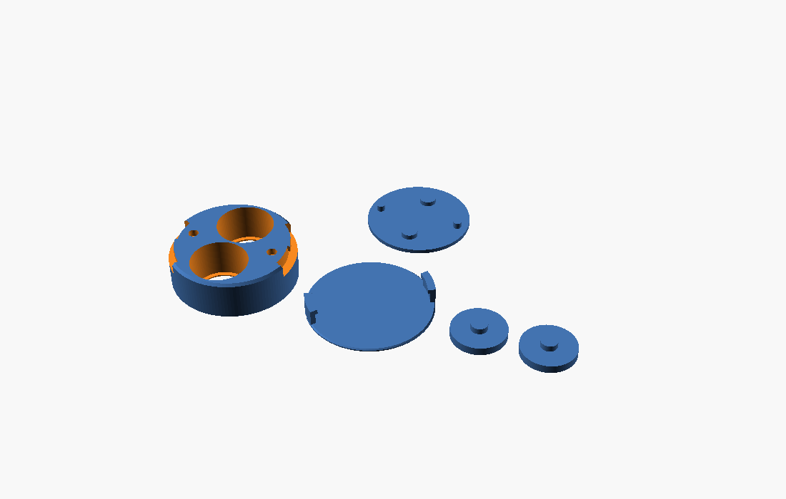

**Mola (compra):** 2 molas de compressão inox **leves**: Ø externo 6 mm, comprimento livre 10 mm, **fio de
0,3 mm** (comprimento sólido ≤ 3 mm). A força fica em ~0,2–0,4 N por pastilha. É muitas vezes o peso da
pastilha, suficiente para segurá-la com o porta-amostras inclinado, e não força a borda. Buscar por
*"mola de compressão inox 0,3 × 6 × 10 mm"*.

**Conferência:** a sobreposição entre corpo, placa de molas e fundo foi verificada no modelo na entrada,
no meio do giro, travado e travado apertado; só há contato de face, sem sobreposição. A borda de 0,6 mm e as folgas da
baioneta (`folga_b = 0,25`) são os pontos a confirmar na primeira impressão.

## Terceiro modelo: mola + tampa de baioneta (tudo impresso)

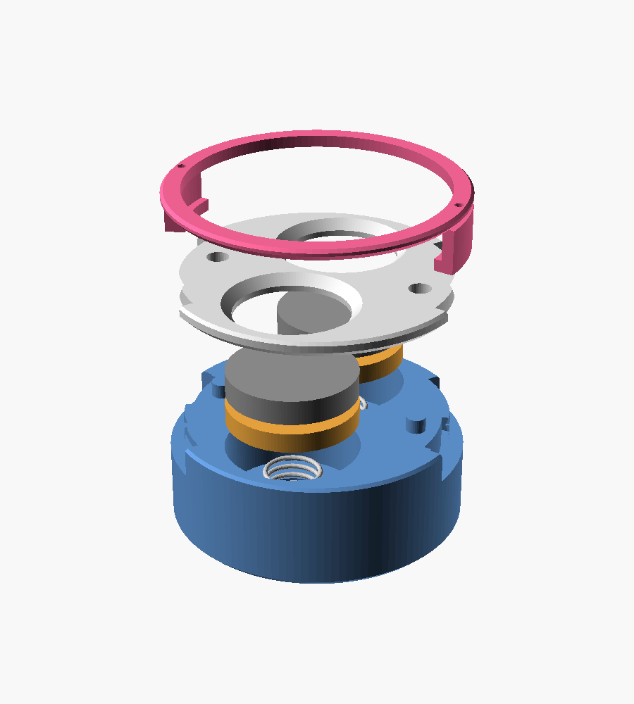

Em `x1c_mola_baioneta_2x13mm.scad`, o porta-amostras não tem rosca, parafuso nem inserto. **Só as 2 molas
são compradas.** O fechamento segue o princípio do pote de conserva:

- **Tampa:** disco plano com as janelas. Desce reto sobre as pastilhas e **não gira**, porque 2 pinos da
  base a travam. Assim nada raspa a face de análise.
- **Anel de baioneta:** aro fino por cima da tampa, com 2 garras. É a **única peça que gira**.
- **Trava:** a mola empurra a tampa e o anel para cima, e o dente de cada garra sobe num rebaixo. Isso dá
  o "clique" e impede que o anel gire sozinho.

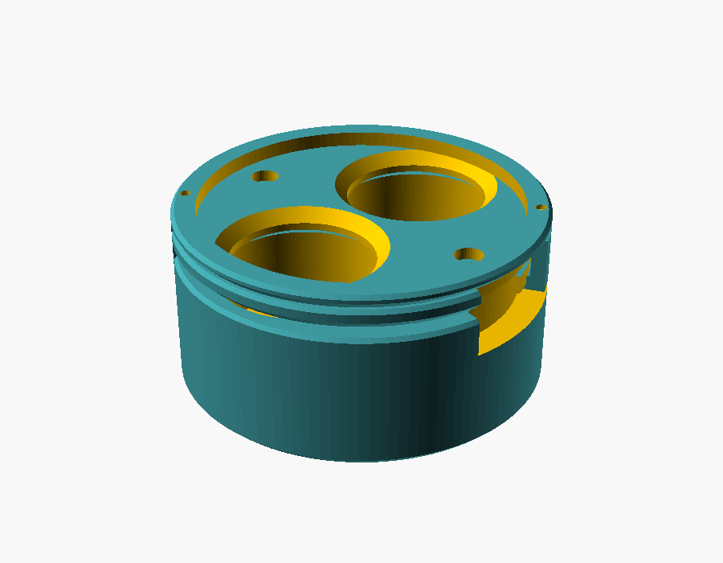

**Montagem:**
1. Coloque a mola no poço, o pistão por cima (pino para baixo) e a pastilha com a face para cima.
2. Encaixe a tampa nos 2 pinos da base. Ela só entra numa posição e desce reta.
3. Posicione o anel com as garras nos rasgos da base. Os pontos gravados no aro ficam sobre as garras.
4. **Empurre para baixo e gire ~35° no sentido anti-horário** (visto de cima) até sentir o clique.
5. Para abrir, empurre e gire no sentido horário. A mola levanta a tampa e as pastilhas.

**Medidas:**
- Altura total de **14 mm**: base de 11,2 mm + tampa de 1,6 mm + aro de 1,2 mm. Confira se o
  porta-amostras aceita essa altura.
- Ao travar, a tampa fica 0,75 mm acima da base. As duas faces continuam no mesmo plano, encostadas na
  tampa.
- O aro do anel tem raio interno de 13 mm e não cobre a área útil das janelas.

| Arquivo (`stl/x1c_mola_baioneta/`) | Como imprimir |
|---|---|
| `base.stl` | Em pé (fundo na mesa), sem suporte. |
| `tampa.stl` | Face de baixo na mesa: é a face de referência que encosta nas pastilhas. |
| `anel.stl` | Já exportado **de cabeça para baixo** (aro na mesa, garras para cima), sem suporte. |
| `pistao.stl` | 2 unidades, face plana na mesa (pino para cima). |

Material e configuração: os mesmos da seção X1C (PC ou PETG; `material` no arquivo).

**Compra:** só **2 molas de compressão inox** (Ø 6 mm, livre 10 mm, fio 0,4–0,5 mm).

**Conferência do encaixe:** a interferência entre as peças foi verificada no modelo em três posições
(entrada, meio do giro e travado), e não há sobreposição. As folgas da baioneta (0,25 mm) e a pequena
saliência de 0,8 mm do dente são pontos a confirmar na primeira impressão. Se o giro ficar duro, aumente
`folga_b`.

## Fabricação

- **Versão para 3 pastilhas:** a parede da borda fica com ~0,5 mm. Usine em alumínio, PEEK ou POM
  (Delrin), ou imprima em resina SLA. Não use impressão FDM.
- **Tampa:** fica melhor em metal fino, como alumínio ou inox de 1,5 mm cortado a laser ou usinado,
  depois escareado.
- **Versões para 2 ou 1 pastilha:** são mais robustas e podem ser impressas em FDM (PETG) para teste.
- **Furos:** os de 2,5 mm são para abrir rosca M3 com macho, e os de 1,6 mm na base, para rosca M2. Em
  peça impressa, prefira insertos metálicos (aumente o furo conforme o inserto).
- **Teste de encaixe:** faça antes com uma pastilha real. `folga_pastilha` = 0,05–0,15 mm para usinagem
  e 0,15–0,25 mm para impressão.

## Contaminação

Só a pastilha é ablada. O suporte, a tampa e o calço não entram no plasma, desde que o laser não seja
posicionado na borda da janela. Recomenda-se:

- limpar as peças em ultrassom (água ultrapura / etanol) entre usos;
- fazer pré-ablação (pulsos de limpeza) antes da aquisição.

## Regenerar os STL

```sh
openscad -o stl/base_3x13mm_tampa.stl   -D 'peca="base"'  -D n_pastilhas=3 porta_amostras_30mm.scad
openscad -o stl/tampa_3x13mm.stl        -D 'peca="tampa"' -D n_pastilhas=3 porta_amostras_30mm.scad
openscad -o stl/base_2x13mm_lateral.stl -D 'peca="base"'  -D n_pastilhas=2 -D 'fixacao="lateral"' porta_amostras_30mm.scad
openscad -o stl/pistao_13mm.stl         -D 'peca="pistao"' porta_amostras_30mm.scad
```
